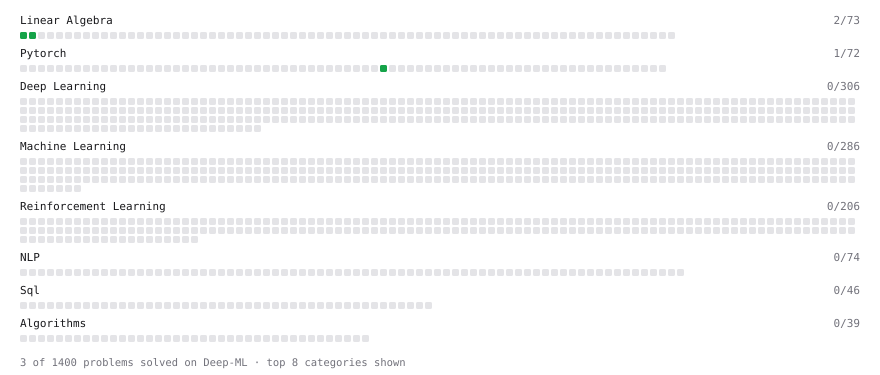

# Deep-ML

My machine learning practice from [Deep-ML](https://www.deep-ml.com). Every solution here was written by hand.

**5** solved · 5 problems · 0 labs · 0 math

[**Browse the interactive portfolio**](https://Muhammad-Saaaad.github.io/deep-ml/) to replay this filling in over time.

## Problems

| | Difficulty | Solved | |
| --- | --- | --- | --- |
| [Matrix-Vector Dot Product](https://www.deep-ml.com/problems/1) | easy | 2026-09-15 | [solution](problems/0001-matrix-vector-dot-product) |
| [Mean Squared Error from Scratch](https://www.deep-ml.com/problems/1228) | easy | 2026-09-15 | [solution](problems/1228-mean-squared-error-from-scratch) |
| [Transpose of a Matrix](https://www.deep-ml.com/problems/2) | easy | 2026-09-15 | [solution](problems/0002-transpose-of-a-matrix) |
| [Calculate Eigenvalues of a Matrix](https://www.deep-ml.com/problems/6) | medium | 2026-09-15 | [solution](problems/0006-calculate-eigenvalues-of-a-matrix) |
| [Matrix Transformation ](https://www.deep-ml.com/problems/7) | medium | 2026-09-15 | [solution](problems/0007-matrix-transformation) |

---

_This file is regenerated by Deep-ML on every push._
